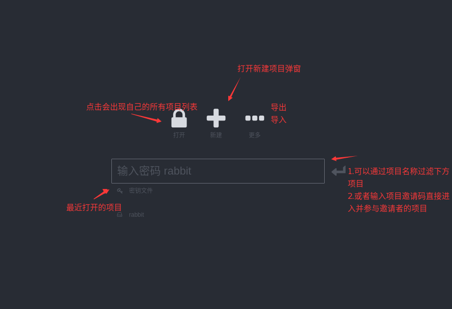

# 项目流程

## 界面示例

 TODO 项目列表
 TODO 新建项目弹窗
- api规则

| 前缀 | 用途 |
| ----- | ----- |
| ${HOST}/design | 开发设计平台访问路径 |
| ${HOST}/design/${项目名} | 开发设计某个项目的路径 |
| 待定? | 开发设计平台资源路径 |
| 待定? | 开发设计平台请求路径 |
| ${HOST}/design/${项目名}/assets | 开发某个项目的资源路径 |
| ${HOST}/design/${项目名}/api | 开发某个项目的请求路径 |
| ${HOST}/open/${项目名} | 打开某个项目的路径 |

- 权限
    - 访问时头部带有用户token,并且访问链接带有项目名称,
    通过token获取用户ID+项目名称获取项目ID
    
- db
    - projectID
    - projectName 项目名称
    - projectDesc 项目描述
    - projectAlias 项目别名(较为特殊的字段后面补需求)
- socket
    - 进入项目
    - 用户离线
    - 退出项目
    
- 例:

| <用户1> 拥有的项目 | <用户2> 拥有的项目 |    |
|:------------|:------------|:---|
| test(测试项目1) | test(测试项目2) |    |
| esf(鹅师父)    | weSure(微保)  |    |

- 用户1访问 http://47.105.84.128/open/test
    - 结果: 访问**测试项目1**的首页
- 用户1访问 http://47.105.84.128/open/esf
    - 结果: 访问**鹅师父**的首页
- 用户1访问 http://47.105.84.128/open/weSure
    - 结果: 访问出错,你没有该项目
- 用户2访问 http://47.105.84.128/open/test
    - 结果: 访问**测试项目2**的首页
- 用户2访问 http://47.105.84.128/open/weSure
    - 结果: 访问**微保**的首页
