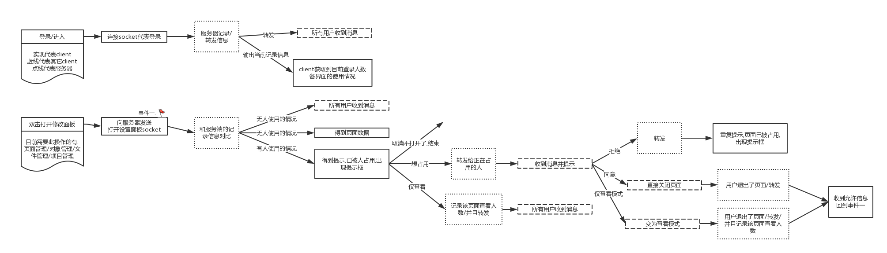

# 侧边拦-页面管理(page)
- 新建类型
    - [目录:组件]/[目录:目录]/[目录:路由]/[页面]
- 规则
    - [目录:组件]
        - 只能在项目下新建
        - 一个项目只能有一个
        - 该目录下一级只能是[目录]/[页面]
    - [目录:路由]
        - 只能在项目下新建
        - 该目录下只能存在一个[页面]
        - 该目录下一级只能是[目录]/[页面]
    - [目录:目录]
        - 目录下只能新建[目录]/[页面]
    - [页面]
        - 页子节点
- db
    - pageName:页面名称
        - 必填*
        - require
            - 同一个项目不能有同名的页面名称,同一个目录不能有相同的目录名称
            - 页面做严格校验,目录做宽松校验(1)
    - pageDesc:页面描述
    - pageType:页面类型
        - 必填*
        - [dir/page/router/component]
- socket
    - 修改页面
    - 进入页面
    - 退出页面
    - 删除页面
    - 新增页面
    
socket流程介绍

- 快捷键
    - 复制(ctrl+c)
    - 粘贴(ctrl+v)
    - 剪切(ctrl+x)
    - 删除(delete)
    - 回退(ctrl+z)
    - 前进(ctrl+shift+z)
    - 选择对比文件(ctrl-d)
    - 显示搜索框(ctrl+f)
- 拖拽
    - 移动目录/文件
    - 移动到page-editor.interface 创建组件 <${pageName}></${pageName} 仅页面类型
    - 移动到stage-bar 打开页面 仅页面类型
- 注
    - (1)
        - name校验(严格)
            - /^[a-z]/g 首字母必须小写字母
            - ^[a-z_][a-z0-9_-]*[a-z0-9]*$ 只允许小写字母与数字和符号'_''-'
        - name校验(宽松)
            - /^[A-Za-z_@\(][A-Za-z0-9_\-\*\(\)]*[A-Za-z0-9]$/g

